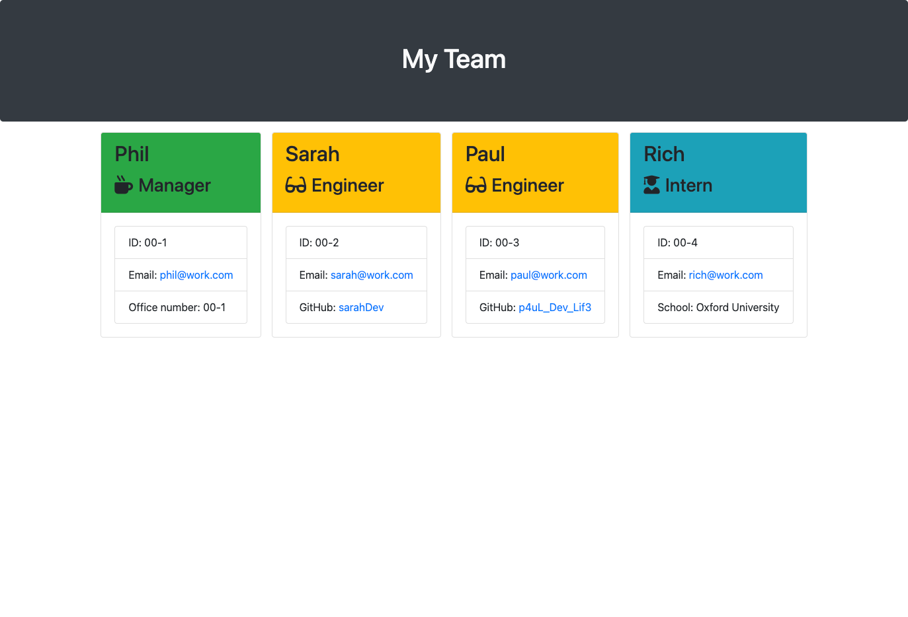

## License

[](https://opensource.org/licenses/MIT)

# Team Profile Generator

## Table of Contents

- [Description](#description)
- [Installation](#installation)
- [Usage](#usage)
- [License](#license)
- [Contributions](#contributions)
- [Images](#images)
- [Questions](#questions)

## Description

CLI application that generates a HTML webpage displaying a team of people based on use input.

Here is a list of languages/technologies used:

- JavaScript
- Node.js
- NPM
- Inquirer
- Jest

## Installation

Before you start to use the `Team Profile Generator` you will firstly need to have [Node.js](https://nodejs.org/en) installed.

To install Node.js follow the on-screen instructions based on your OS.

1. Clone this [repo](https://github.com/PhilC7/team-profile-generator) to your local machine.

2. Open the terminal, making sure the root directory is at the `Team Profile Generator`.

3. From the command line install the Inquirer package using the command: `npm i inquirer@^8.0.0`

4. To make sure Jest is installed type the following in to your command line`npm install`

## Usage

Once you have Node.js, Inquirer and Jest installed do the following:

1. Making sure your root directory is at the `Team Profile Generator` in your terminal. Run the command:

```bash
node index.js
```

2. Follow the on screen prompts, answering all questions.

3. Once all prompts have been answered your new `team.html` file will hav been created inside the output folder.

## Contributions

Would you like to contribute? Contact me [here](https://github.com/PhilC7).

## Images

Here is an example of how the generated HTML page will look:



## Questions

Any questions? Contact me [here](https://github.com/PhilC7).
